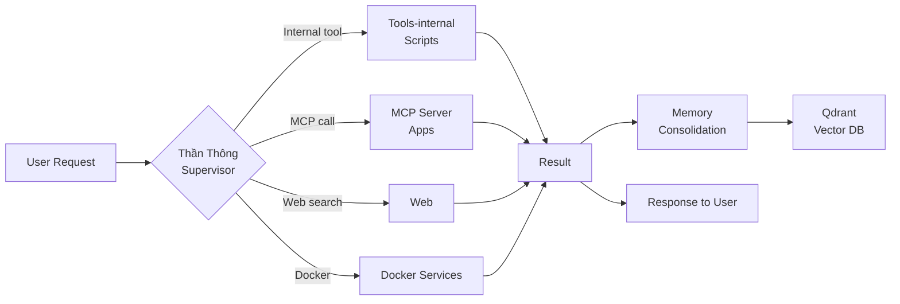
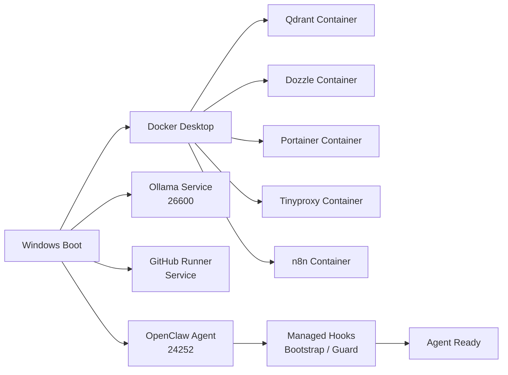
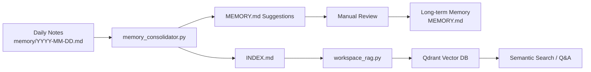
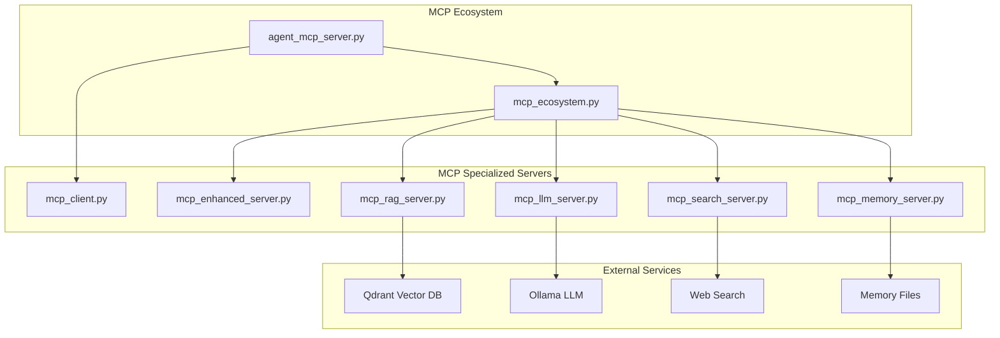
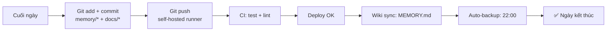

# Target OpenClaw System Design

**Date:** 2026-05-16
**Status:** Target architecture — not yet applied
**Based on:** SYSTEM_MAP.md, REORGANIZE_PLAN.md, WORKFLOW_MAP.md
**Workspace Root:** `E:\KY-DATA\OpenClaw\runtime-mirror\.openclaw\workspace`

---

## 1. Mục tiêu thiết kế

### 1.1. Mục đích

Xây dựng cấu trúc hệ thống OpenClaw hoàn chỉnh, rõ ràng, dễ bảo trì, dễ mở rộng, với ưu tiên:

- **Rành mạch (Separation of Concerns):** Mỗi thư mục có một mục đích duy nhất, không overlap.
- **Local-first & Billing-safe:** Mọi thao tác ưu tiên local, không phát sinh chi phí nếu chưa được duyệt. "Thần thông" gate là lớp kiểm soát đầu tiên cho mọi request.
- **Tối giản chi phí vận hành:** Docker containers chỉ chạy khi cần. Configs tập trung. Logs/cache/data tách bạch.
- **Dễ onboard:** Người mới nhìn vào cấu trúc là hiểu ngay component nào ở đâu, làm gì.
- **Dễ scale:** Thêm skill mới, workflow mới, service mới không làm rối cấu trúc hiện tại.

### 1.2. Nguyên tắc thiết kế

1. **Một thư mục — một trách nhiệm:** Không có file "vứt đại" vào root.
2. **Immutable startup files:** `AGENTS.md`, `SOUL.md`, `TOOLS.md`, `USER.md`, `MEMORY.md`, `IDENTITY.md` không được move (OpenClaw load từ hardcoded path).
3. **Skills bất động:** `skills/<name>/SKILL.md` giữ nguyên vị trí (OpenClaw scan từ startup).
4. **Config ≠ Code ≠ Data:** Ba lớp tách biệt hoàn toàn.
5. **Docker là ephemeral:** Container data (volumes) mapping rõ ràng, không phụ thuộc vào container lifecycle.
6. **Workflows là template:** Không chứa runtime state, chỉ chứa định nghĩa luồng.
7. **Audit là snapshot:** `_audit/` chứa file tĩnh, không có process ghi đè vào.

### 1.3. Mô hình 3 lớp (Three-Layer Model)

```
┌─────────────────────────────────────────────┐
│              Lớp Giao Diện                    │
│  Telegram · WebChat · GitHub Issues · Cron   │
├─────────────────────────────────────────────┤
│              Lớp Xử Lý                        │
│  OpenClaw Agent · Than Thong Gate · Workflow │
├─────────────────────────────────────────────┤
│              Lớp Hạ Tầng                      │
│  Docker · Ollama · Qdrant · n8n · Runner     │
└─────────────────────────────────────────────┘
```

---

## 2. Sơ đồ tổng thể (Mermaid flowchart)

```mermaid
flowchart TB
    subgraph "Lớp Giao Diện (Interface Layer)"
        TG[Telegram]
        WC[WebChat]
        GH[GitHub Events]
        CR[Cron Scheduler]
    end

    subgraph "Lớp Xử Lý (Processing Layer)"
        OC[OpenClaw Agent Runtime<br/>node:24252]
        TGATE{Thần Thông Gate}
        subgraph "Orchestration"
            WF[Workflow Engine<br/>n8n]
            GHWR[GitHub Runner]
        end
    end

    subgraph "Lớp Hạ Tầng (Infrastructure Layer)"
        subgraph "Docker Services"
            QD[Qdrant<br/>Vector DB :6333-6334]
            DZ[Dozzle<br/>Log Viewer :8888]
            PT[Portainer<br/>Docker UI :9000]
            TP[Tinyproxy<br/>Proxy :1080]
            N8N[n8n-pro<br/>Automation]
            IW[Image Worker<br/>(exited)]
        end
        subgraph "Local Services"
            OLL[Ollama<br/>LLM Server :11434]
            PY[Python Workers<br/>:9876-9880]
            DS[Docker Desktop<br/>Management]
        end
        subgraph "Storage"
            MEM[Memory<br/>memory/*.md]
            QD_VEC[Qdrant<br/>Vector Store]
            SQL[(SQLite<br/>n8n-db)]
        end
    end

    TG --> OC
    WC --> OC
    GH --> GHWR
    CR --> GHWR
    CR --> N8N

    OC --> TGATE
    TGATE -->|Local OK| PY
    TGATE -->|Web/Search| WEB[Web Search/Fetch]
    TGATE -->|Billing Risk| STOP[Billing Guard - BLOCK]
    TGATE -->|MCP| MCP[MCP Servers]

    OC --> MEM
    OC --> QD
    OC --> OLL
    GHWR --> OC
    N8N --> OC
```

### 2.1. Luồng xử lý chính



### 2.2. Luồng startup hệ thống



---

## 3. Cấu trúc thư mục mục tiêu

### 3.1. Root workspace (immutable — không move)

```
E:\KY-DATA\OpenClaw\runtime-mirror\.openclaw\workspace\
├── AGENTS.md              # Startup identity — DO NOT MOVE
├── SOUL.md                # Personality — DO NOT MOVE
├── TOOLS.md               # Tool notes — DO NOT MOVE
├── USER.md                # Human info — DO NOT MOVE
├── MEMORY.md              # Long-term memory — DO NOT MOVE
├── IDENTITY.md            # Agent identity — DO NOT MOVE
├── THAN-THONG-DEFAULT-BEHAVIOR.md  # Default gate behavior
│
├── skills/                # Skill registry — DO NOT MOVE
├── memory/                # Daily notes — DO NOT MOVE
├── .github/workflows/     # CI/CD — DO NOT MOVE
│
├── openclaw-system/       # <<< HỆ THỐNG MỚI >>>
│   ├── apps/              # Runtime applications
│   ├── configs/           # Configuration files
│   ├── tools/             # Executable tools & utilities
│   ├── workflows/         # Workflow definitions
│   ├── memory/            # Curated system memory
│   ├── data/              # Runtime data
│   ├── docs/              # Documentation
│   ├── scripts/           # Lifecycle scripts
│   └── _audit/            # Audit snapshots (symlink)
│
├── _audit/                # Audit data (live working dir)
├── runner/                # GitHub Actions runner (standalone)
├── packaging/             # Desktop tray packaging
├── tests/                 # Test suite
├── utils/                 # Python helpers
├── config/                # (sẽ migrate vào openclaw-system/configs/)
├── tools-internal/        # (sẽ migrate vào openclaw-system/tools/ + apps/)
├── references/            # (sẽ migrate vào openclaw-system/docs/references/)
├── reports/               # (sẽ migrate vào openclaw-system/docs/reports/)
├── hooks/                 # (sẽ migrate vào openclaw-system/scripts/)
├── managed-hooks/         # (sẽ migrate vào openclaw-system/scripts/)
├── examples/              # (sẽ migrate vào openclaw-system/workflows/)
├── expansion/             # (sẽ migrate vào openclaw-system/docs/expansion/)
├── archive/               # (sẽ migrate vào openclaw-system/data/archive/)
├── khai-thac/             # (sẽ migrate vào openclaw-system/tools/khai-thac/)
├── review/                # (sẽ migrate vào openclaw-system/tools/review/)
├── models/                # (sẽ migrate vào openclaw-system/tools/models/)
├── runtime-guard/         # (sẽ migrate vào openclaw-system/apps/guards/)
└── scripts/               # (sẽ migrate vào openclaw-system/tools/scripts/)
```

### 3.2. Chi tiết `openclaw-system/`

```
openclaw-system/
│
├── apps/                              # Runtime application code
│   ├── agent/                         # Agent runtime + memory
│   │   ├── agent_memory.py
│   │   ├── agent_search.py
│   │   ├── agent-memory/              # Memory store data
│   │   └── agent-memory-v2/
│   ├── mcp/                           # MCP servers
│   │   ├── agent_mcp_server.py
│   │   ├── mcp_client.py
│   │   ├── mcp_ecosystem.py
│   │   ├── mcp_enhanced_server.py
│   │   ├── mcp_llm_server.py
│   │   ├── mcp_memory_server.py
│   │   ├── mcp_rag_server.py
│   │   ├── mcp_search_server.py
│   │   ├── start_mcp.bat
│   │   └── start_mcp_ecosystem.ps1
│   ├── rag/                           # RAG engine
│   │   └── rag_engine.py
│   ├── services/                      # Service discovery
│   │   └── service_discovery.py
│   ├── gateway/                       # API gateway
│   │   ├── api_gateway.py
│   │   └── test_gateway.py
│   ├── dashboard/                     # Web dashboard
│   │   ├── dashboard_web.py
│   │   └── test_dashboard.py
│   ├── guards/                        # Runtime guards
│   │   └── than-thong-guard/          # (from runtime-guard/)
│   └── __pycache__/                   # (gitignored, auto-gen)
│
├── configs/                           # All configuration
│   ├── env/                           # Environment files
│   │   ├── .env.rate-limit
│   │   └── .tools-internal.env
│   ├── state/                         # Runtime state files
│   │   └── .rate_limit_state.json
│   ├── secrets/                       # Sensitive config
│   │   ├── gcp-n8n-vertex-ai-key.json
│   │   ├── .vault.json
│   │   ├── .vault.lock
│   │   └── .vault_key
│   ├── prompts/                       # Prompt templates
│   │   ├── prompts-template.yaml
│   │   └── (prompt database files from config/prompt-templates/)
│   ├── policies/                      # Policy definitions
│   │   ├── (from tools-internal/policy/)
│   │   └── (from config/policy-templates/)
│   ├── spec/                          # Spec files
│   │   ├── than-thong.spec
│   │   └── packaging-than-thong.spec
│   ├── scripts/                       # Config-related scripts
│   │   └── rate-limit.ps1
│   ├── git/                           # Git configs
│   │   └── .gitignore
│   ├── registry.json                  # Internal tool registry
│   └── docs/                          # Internal config docs
│       └── internal-README.md
│
├── tools/                             # Executable tools & utilities
│   ├── scripts/                       # Core internal tools (from tools-internal/scripts/)
│   │   ├── than_thong_console.py
│   │   ├── than_thong_gate.py
│   │   ├── than_thong_wrapper.py
│   │   ├── than_thong_entry.py
│   │   ├── than_thong_supervisor.py
│   │   ├── preflight_runner.py
│   │   ├── import_orchestrator.py
│   │   ├── import_validator.py
│   │   ├── deep_validator.py
│   │   ├── candidate_builder.py
│   │   ├── sync_executor.py
│   │   ├── rollback_manifest.py
│   │   ├── real_rollback.py
│   │   ├── domain_tracker.py
│   │   ├── duplicate_checker.py
│   │   ├── canonical_checker.py
│   │   ├── drift_checker.py
│   │   ├── wave_manager.py
│   │   ├── ops_dashboard.py
│   │   ├── ops_console.py
│   │   ├── trusted_registry.py
│   │   ├── compliance_audit.py
│   │   ├── auto_maintain.py
│   │   ├── top_gate.py               # (legacy alias)
│   │   ├── top_wrapper.py            # (legacy alias)
│   │   ├── top_console.py            # (legacy alias)
│   │   ├── billing_gate.py           # (legacy alias)
│   │   ├── task_router.py
│   │   ├── top_win_*.py              # Windows audit tools
│   │   └── watchdog_log.ps1
│   ├── lib/                           # Internal library modules (tools-internal/_*.py)
│   │   ├── __main__.py
│   │   ├── _config.py
│   │   ├── _pyhelper.py
│   │   └── (other _*.py files)
│   ├── browser/                       # Browser automation
│   │   └── browser.py
│   ├── monitoring/                    # Monitoring scripts
│   │   └── gpu-monitor.ps1
│   ├── media/                         # Media tools
│   │   ├── play_song.py
│   │   └── cleanup_voice.py
│   ├── analytics/                     # Analytics tools
│   │   └── model_usage.py
│   ├── n8n/                           # n8n administration
│   │   ├── create-cred.py
│   │   ├── create-http-workflow.py
│   │   └── create-workflow.py
│   ├── win/                           # Windows tools
│   │   ├── uninstall-apps.cmd
│   │   └── uninstall-apps.ps1
│   ├── test/                          # Test scripts
│   │   ├── gemini-api.py
│   │   ├── gemini-key.py
│   │   ├── gemini-openai.py
│   │   ├── vertex-ai-key.py
│   │   └── run_tests.py
│   ├── webhook/                       # Webhook tools
│   │   └── gemini-webhook.py
│   ├── security/                      # Security/protect scripts
│   │   └── (from tools-internal/protect/)
│   ├── extracted/                     # Extracted third-party scripts
│   │   └── (from tools-internal/extracted-scripts/)
│   ├── khai-thac/                     # External source mining
│   │   └── (from khai-thac/)
│   ├── review/                        # Skill review pipeline
│   │   └── (from review/)
│   ├── models/                        # ML models
│   │   └── (from models/)
│   ├── tmux/                          # Tmux helpers (from scripts/tmux/)
│   ├── video/                         # Video tools (from scripts/video/)
│   └── whisper/                       # Whisper tools (from scripts/whisper/)
│
├── workflows/                         # Workflow definitions (templates, not runtime)
│   ├── lobster/                       # Lobster workflow files
│   │   ├── inbox-triage.lobster
│   │   └── pr-intake.lobster
│   ├── content/                       # Content workflows
│   ├── automation/                    # Automation examples
│   ├── code-review/                   # Code review examples
│   └── templates/                     # Document/workflow templates
│
├── memory/                            # Curated system memory (NOT daily notes)
│   ├── long-term/                     # Long-term memory artifacts
│   │   └── MEMORY.md                  # (symlink to workspace root)
│   ├── rules/                         # Operating rules
│   │   ├── than-thong-rule.md
│   │   ├── billing-rule.md
│   │   ├── than-thong-super-policy.md
│   │   └── than-thong-behavior.md
│   └── system-map/                    # System topology docs
│       ├── SYSTEM_MAP.md
│       ├── WORKFLOW_MAP.md
│       └── TARGET_SYSTEM_DESIGN.md
│
├── data/                              # Runtime data (not git-tracked)
│   ├── db/                            # SQLite databases
│   │   └── n8n-db2.sqlite
│   ├── rag/                           # RAG indexes and vectors
│   │   └── (from tools-internal/rag-data/)
│   ├── records/                       # Run records, logs
│   │   └── (from tools-internal/records/)
│   ├── auth/                          # Auth token/user store
│   │   ├── tokens.json
│   │   └── users.json
│   ├── reference-library/             # Reference library data
│   │   └── (from tools-internal/reference-library/)
│   ├── archive/                       # Deprecated/archived files
│   │   └── (from archive/)
│   ├── analytics/                     # Analytics data files
│   │   ├── rate-limit-*.jsonl
│   │   └── automation-stack.json
│   ├── manifests/                     # File manifests
│   │   └── engram-manifest.json
│   ├── api-specs/                     # API specifications
│   │   └── voicebox-api-spec.json
│   ├── logs/                          # Service logs
│   │   └── runner/                    # GitHub runner logs
│   ├── cache/                         # Application cache
│   │   └── jiti/                      # JITI cache
│   └── downloads/                     # Downloaded files
│
├── docs/                              # All documentation (markdown)
│   ├── references/                    # Imported reference knowledge (from references/)
│   │   ├── agent-mesh/
│   │   ├── agent-patterns/
│   │   ├── api-integration/
│   │   ├── automation/
│   │   ├── cli-patterns/
│   │   ├── code-management/
│   │   ├── compliance/
│   │   ├── content-management/
│   │   ├── device-control/
│   │   ├── documentation/
│   │   ├── himalaya/
│   │   ├── infrastructure/
│   │   ├── memory-knowledge/
│   │   ├── model-usage/
│   │   ├── retrieval/
│   │   ├── system-admin/
│   │   ├── work-management/
│   │   └── workspace-governance/
│   ├── reports/                       # Generated reports (from reports/)
│   │   └── README.md
│   ├── catalogs/                      # Skill catalogs
│   │   └── awesome-skills-catalog/
│   ├── expansion/                     # Import pipeline docs (from expansion/)
│   │   ├── README.md
│   │   ├── candidates/               # (reference knowledge candidates)
│   │   ├── checklists/
│   │   ├── domains/
│   │   ├── import-map/
│   │   ├── inventory/
│   │   ├── plans/
│   │   ├── queue/
│   │   ├── rollback/
│   │   └── sync/
│   ├── integrations/                  # Integration docs (dot2-*.md)
│   ├── automation/                    # Automation docs
│   ├── skills/                        # Skills documentation
│   │   ├── README.md
│   │   └── SKILL-REGISTRY.md
│   ├── rules/                         # Behavior documentation
│   ├── CHANGES.md
│   ├── CHANGELOG.md
│   ├── DATA-STORE.md
│   ├── DIRECTORY-MAP.md
│   ├── QUICK-START.md
│   ├── README.md
│   ├── REFERENCE-INDEX.md
│   ├── WORKSPACE.md
│   ├── progress.md
│   ├── task_plan.md
│   └── findings.md
│
├── scripts/                           # Lifecycle scripts
│   ├── startup/                       # Startup hooks
│   │   └── than-thong-startup/        # (from managed-hooks/)
│   ├── shutdown/                      # Shutdown hooks
│   │   ├── than-thong-shutdown/       # (from managed-hooks/)
│   │   └── than-thong-stop-logger/    # (from managed-hooks/)
│   ├── health/                        # Health monitoring
│   │   └── watchdog_log.ps1
│   ├── sync/                          # Sync scripts
│   │   └── oh-sync.ps1
│   ├── build/                         # Build scripts
│   │   ├── build.bat
│   │   └── build.py
│   ├── legacy-hooks/                  # Legacy hooks (from hooks/)
│   ├── than-thong.cmd                # Main entry point
│   └── rollback.cmd                   # Rollback entry point
│
└── _audit/                            # Audit snapshots (symlink to workspace-root _audit/)
    └── (audit/docs/reports — read-only snapshots)
```

---

## 4. Cấu trúc config mục tiêu

### 4.1. Bốn loại config

| Loại | Thư mục | Ví dụ | Ghi chú |
|------|---------|-------|---------|
| **Môi trường (env)** | `configs/env/` | `.env`, `.env.rate-limit` | Có thể có secrets nhẹ |
| **Bí mật (secrets)** | `configs/secrets/` | GCP key, vault key | .gitignored, không push |
| **Chính sách (policy)** | `configs/policies/` | billing, than-thông policy | Public, version-controlled |
| **Template** | `configs/prompts/`, `configs/spec/` | YAML prompt, .spec | Public |

### 4.2. Nguyên tắc config

```
1. Environment variables > config files > hardcoded defaults
2. Secrets NEVER in code — only in configs/secrets/ or env vars
3. Git-tracked configs go in configs/prompts/, configs/policies/, configs/spec/
4. Non-git-tracked configs go in configs/env/, configs/secrets/, configs/state/
5. Config files from root (config/) migrated to openclaw-system/configs/
```

### 4.3. Config mapping hiện tại → mục tiêu

| Hiện tại | Target | Priority |
|----------|--------|----------|
| `config/` (6 files) | `openclaw-system/configs/` | CAO |
| `tools-internal/.env` | `configs/env/.tools-internal.env` | CAO |
| `tools-internal/.vault.*` | `configs/secrets/` | CAO |
| `tools-internal/policy/` | `configs/policies/` | CAO |
| `packaging/than-thong.spec` | `configs/spec/` | TRUNG BÌNH |
| `than-thong.spec` (root) | `configs/spec/` | TRUNG BÌNH |
| Expansion pipeline docs | `docs/expansion/` | THẤP |
| `tools-internal/registry.json` | `configs/registry.json` | CAO |

---

## 5. Cấu trúc workflow mục tiêu

### 5.1. Phân loại workflow

| Nhóm workflow | Trigger | Runner | Mục đích |
|--------------|---------|--------|----------|
| **CI (Continuous Integration)** | Push, PR | GitHub Runner | test, lint, syntax check |
| **CD (Continuous Deployment)** | Push master | GitHub Runner | Deploy to workspace |
| **Bảo trì (Maintenance)** | Cron | GitHub Runner | Backup, health check, pip check |
| **Tự động hóa (Automation)** | User request | n8n | n8n workflows |
| **AI Agent** | User message | OpenClaw Agent | Agent trả lời, tool calling |

### 5.2. Workflow template structure (lobster)

```
workflows/lobster/
├── inbox-triage.lobster    # Xử lý inbox messages
└── pr-intake.lobster       # Xử lý PR intake
```

### 5.3. GitHub Actions workflows (12 files — stay at .github/workflows/)

| File | Trigger | Runner | Purpose |
|------|---------|--------|---------|
| auto-backup.yml | Push + cron daily | self-hosted | Workspace backup |
| auto-fix.yml | Push | self-hosted | BOM/whitespace fixes |
| auto-review.yml | PR | self-hosted | AI review with local LLM |
| deploy.yml | Push master | self-hosted | Test → deploy |
| health-check.yml | Cron daily 7AM | self-hosted | System health |
| issue-handler.yml | Issue | self-hosted | Issue triage |
| pip-check.yml | Push (pip) | self-hosted | Dependency validation |
| pr-review.yml | PR | self-hosted | PR review automation |
| release.yml | Tag v* | self-hosted | GitHub Release |
| skill-check.yml | Cron weekly | self-hosted | Skill catalog sync |
| test.yml | PR + push | self-hosted | Pytest suite |
| wiki-sync.yml | Push (wiki) | self-hosted | MEMORY.md → GitHub Wiki |

### 5.4. Nguyên tắc workflow

```
1. Workflow templates (lobster) → openclaw-system/workflows/
2. Active workflow config (GitHub Actions) → .github/workflows/ (immutable)
3. n8n workflow definitions → n8n container volume (n8n_data)
4. Workflow không chứa runtime state
5. Mỗi workflow có trigger rõ ràng
6. Workflow dùng self-hosted runner (không cloud runner)
```

---

## 6. Cấu trúc memory/rules mục tiêu

### 6.1. Hai lớp memory

```
Lớp 1: Daily Notes (workspace root — workspace/memory/)
├── memory/YYYY-MM-DD.md    # Raw daily logs
├── memory/INDEX.md         # Consolidated index
└── memory/consolidation-reports/  # Auto-generated by memory_consolidator.py

Lớp 2: Curated System Memory (openclaw-system/memory/)
├── memory/long-term/       # Long-term curated memory
│   └── MEMORY.md           # (symlink to root MEMORY.md)
├── memory/rules/           # System operating rules
│   ├── than-thong-rule.md
│   ├── billing-rule.md
│   ├── than-thong-super-policy.md
│   └── than-thong-behavior.md
└── memory/system-map/      # System topology
    ├── SYSTEM_MAP.md
    ├── WORKFLOW_MAP.md
    ├── REORGANIZE_PLAN.md
    └── TARGET_SYSTEM_DESIGN.md
```

### 6.2. Rule hierarchy

```
Level 0: BILLING-RULE.md        → Không tự ý dùng tài nguyên trả phí
Level 1: THAN-THONG-RULE.md     → Mọi lệnh qua thần thông trước
Level 2: THAN-THONG-SUPER-POLICY.md → Gate + Route + Execute
Level 3: THAN-THONG-DEFAULT-BEHAVIOR.md → Hành vi mặc định khi không match rule
Level 4: AGENTS.md              → Agent runtime rules
```

### 6.3. Memory pipeline



### 6.4. Nguyên tắc memory

```
1. Daily notes: ghi mọi thứ, không filter (workspace/memory/)
2. Long-term memory (MEMORY.md): chỉ giữ tinh hoa
3. Memory consolidation chạy tự động (cron daily) hoặc heartbeat
4. RAG index chạy riêng, không blocking main flow
5. System-map docs là curated, cập nhật khi kiến trúc thay đổi
```

---

## 7. Cấu trúc tool/MCP mục tiêu

### 7.1. Phân loại tools

| Category | Location | Examples |
|----------|----------|----------|
| **Internal Scripts** | `tools/scripts/` | than_thong_console.py, import_orchestrator.py |
| **Library Modules** | `tools/lib/` | _config.py, _pyhelper.py |
| **Browser** | `tools/browser/` | browser.py |
| **Monitoring** | `tools/monitoring/` | gpu-monitor.ps1 |
| **Media** | `tools/media/` | play_song.py, cleanup_voice.py |
| **Analytics** | `tools/analytics/` | model_usage.py |
| **n8n Admin** | `tools/n8n/` | create-workflow.py |
| **Windows** | `tools/win/` | uninstall-apps.ps1 |
| **Security** | `tools/security/` | protect/ scripts |
| **Extracted** | `tools/extracted/` | Third-party scripts |
| **Khai Thác** | `tools/khai-thac/` | External mining tools |
| **Review** | `tools/review/` | Skill review pipeline |
| **Models** | `tools/models/` | ML model loaders |
| **Tmux** | `tools/tmux/` | Tmux helpers |
| **Video** | `tools/video/` | Frame extraction |
| **Whisper** | `tools/whisper/` | Audio transcription |
| **Webhook** | `tools/webhook/` | gemini-webhook.py |

### 7.2. MCP Server Architecture



### 7.3. MCP server location

```
openclaw-system/apps/mcp/
├── agent_mcp_server.py          # Core MCP server
├── mcp_client.py                # MCP client
├── mcp_ecosystem.py             # Ecosystem orchestrator
├── mcp_enhanced_server.py       # Enhanced capabilities
├── mcp_llm_server.py            # LLM inference server
├── mcp_memory_server.py         # Memory management
├── mcp_rag_server.py            # RAG retrieval
├── mcp_search_server.py         # Web search
├── start_mcp.bat                # Windows startup
└── start_mcp_ecosystem.ps1      # Ecosystem PowerShell start
```

### 7.4. Nguyên tắc tool/MCP

```
1. Tools stateless, MCP servers stateful — tách biệt
2. Tool scripts không hardcode đường dẫn — dùng config/env
3. MCP servers chạy qua managed hooks (startup/bootstrap)
4. Tools có thể chạy độc lập (không cần MCP ecosystem)
5. MCP ecosystem quản lý lifecycle của các MCP sub-servers
```

---

## 8. Cấu trúc Docker/local service mục tiêu

### 8.1. Docker containers

| Container | Image | Target Status | Ports | Data Volume | Notes |
|-----------|-------|--------------|-------|-------------|-------|
| **qdrant** | qdrant/qdrant:latest | ✅ Running | 6333-6334 | anonymous (→ named) | Cần migrate volume từ anonymous → named |
| **tinyproxy** | vimagick/tinyproxy:latest | ✅ Running | 1080→8888 | none | Proxy cho outbound |
| **n8n-pro** | n8nio/n8n:latest | 🔴 Fix (restarting) | 8080 | n8n_data | Debug restart loop |
| **dozzle** | amir20/dozzle:latest | ✅ Running | 8888→8080 | none | Log viewer |
| **portainer** | portainer/portainer-ce:latest | ✅ Running | 9000 | none | Container management |
| **image-worker** | Custom python:3.11-slim | 🔴 Fix (exited 255) | 8000 | none | Debug startup failure |

### 8.2. Docker volume plan

| Volume | Container | Type | Backup | Notes |
|--------|-----------|------|--------|-------|
| `n8n_data` | n8n-pro | named | ✅ | Keep named |
| `qdrant_data` | qdrant | named (target) | ✅ | Migrate from anonymous |
| `(none)` | dozzle | — | — | Stateless |
| `(none)` | portainer | — | — | Stateless |
| `(none)` | tinyproxy | — | — | Stateless |

### 8.3. Local services

| Service | Process | Port | Target Status | Notes |
|---------|---------|------|--------------|-------|
| **OpenClaw Agent** | node:24252 | — | ✅ Running | 737MB RAM, cần optimize |
| **Ollama** | ollama:26600 | 11434 | ✅ Running | Secure: bind 127.0.0.1 |
| **GitHub Runner** | Runner | — | ✅ Check | Self-hosted |
| **Python Workers** | python:* | 9876-9880 | ⚠️ Document | 7+ workers, cần clear ownership |

### 8.4. Docker compose template (target)

```yaml
# docker-compose.yml (target — openclaw-system/configs/docker/docker-compose.yml)
version: '3.8'

services:
  qdrant:
    image: qdrant/qdrant:latest
    ports: ["6333:6333", "6334:6334"]
    volumes: ["qdrant_data:/qdrant/storage"]
    restart: unless-stopped

  tinyproxy:
    image: vimagick/tinyproxy:latest
    ports: ["8888:8888"]
    restart: unless-stopped

  n8n:
    image: n8nio/n8n:latest
    ports: ["8080:8080"]
    volumes: ["n8n_data:/home/node/.n8n"]
    environment:
      - N8N_SECURE_COOKIE=false
    restart: unless-stopped

  dozzle:
    image: amir20/dozzle:latest
    ports: ["8888:8080"]
    volumes: ["/var/run/docker.sock:/var/run/docker.sock"]
    restart: unless-stopped

  portainer:
    image: portainer/portainer-ce:latest
    ports: ["9000:9000"]
    volumes: ["/var/run/docker.sock:/var/run/docker.sock"]
    restart: unless-stopped

volumes:
  qdrant_data:
  n8n_data:
```

### 8.5. Nguyên tắc Docker/local service

```
1. Docker containers = ephemeral execution — data always in volumes
2. Anonymous volumes → named volumes (backup-able)
3. Mỗi container có healthcheck (trừ tinyproxy)
4. Service restart policy: unless-stopped
5. Docker compose file version-controlled in configs/docker/
6. Python workers cần được document rõ ownership
7. n8n restart loop = priority 1 bug
8. image-worker cần diagnostic trước khi migrated
```

---

## 9. Nguyên tắc bảo mật

### 9.1. Bốn lớp bảo mật

```
Layer 0: Thần Thông Gate — Kiểm soát mọi request trước khi xử lý
Layer 1: Billing Guard — Chặn mọi thao tác có phát sinh chi phí
Layer 2: Secret Management — Vault + file permissions cho secrets
Layer 3: Network Security — Port binding, proxy, local-only services
Layer 4: Access Control — Auth tokens, user store, API keys
```

### 9.2. Quy tắc cụ thể

| Rule | Mô tả |
|------|-------|
| **Billing-safe first** | Mọi action phải qua billing guard trước. Không tự ý gọi API trả phí. |
| **Local-only binding** | Ollama, n8n, Python workers → bind 127.0.0.1 (trừ proxy). |
| **Secret isolation** | Secrets trong `configs/secrets/` — .gitignored, không bao giờ push. |
| **Vault encryption** | `.vault.json` + `.vault_key` + `.vault.lock` cho secrets nặng. |
| **Auth infrastructure** | `data/auth/tokens.json` và `users.json` (hiện tại empty) — cần populate hoặc remove. |
| **No hardcoded keys** | API keys, tokens, credentials không bao giờ hardcode trong code. |
| **Managed hooks audit** | Bootstrap hook, command guard hook kiểm tra mọi lệnh trước khi chạy. |
| **GitGuard** | `.gitignore` phải exclude: secrets/, .env, *.key, *.json (nếu chứa key). |

### 9.3. Checklist bảo mật định kỳ

- [ ] Ollama chỉ bind 127.0.0.1:11434 (không 0.0.0.0)
- [ ] Không có API key nào trong code trừ configs/secrets/
- [ ] `.gitignore` exclude đúng patterns
- [ ] Vault lock file còn hiệu lực
- [ ] Auth tokens không bị lộ trong log
- [ ] Docker containers chạy với non-root user nếu có thể
- [ ] Portainer không expose ra ngoài (hiện tại port 9000 cần kiểm tra binding)

---

## 10. Nguyên tắc vận hành hằng ngày

### 10.1. Startup sequence

```
1. Windows boot
2. Docker Desktop tự động start
3. Ollama service tự động start
4. GitHub Runner service tự động start
5. OpenClaw Agent start (node:24252)
6. Managed hooks chạy: bootstrap → guard → message filter
7. Thần Thông gate active — sẵn sàng nhận lệnh
```

### 10.2. Daily checklist

| Thời gian | Tác vụ | Công cụ |
|-----------|--------|---------|
| Sáng (7AM) | Health check tự động | health-check.yml (GitHub Actions) |
| Sáng | Kiểm tra n8n container đang chạy | `docker ps` |
| Sáng | Kiểm tra memory consolidation | heartbeats |
| Trong ngày | Ghi daily notes vào `memory/YYYY-MM-DD.md` | Agent tự động |
| Trong ngày | Xử lý GitHub Issues nếu có | issue-handler.yml |
| Chiều | Review skill updates (nếu có) | skill-check.yml |
| Tối (10PM) | Auto backup workspace | auto-backup.yml |
| Hàng tuần (CN) | Consolidate memory → MEMORY.md | Manual + memory_consolidator.py |

### 10.3. Troubleshooting triage

```
Symptom: n8n restarting
  → Check: docker logs n8n-pro
  → Fix: check N8N_SECURE_COOKIE, volumes, port conflicts

Symptom: Node.js high RAM (>1GB)
  → Check: memory leak or heavy model load
  → Fix: restart agent, check model_usage.py

Symptom: Ollama not responding
  → Check: ollama list, ollama ps
  → Fix: restart ollama service

Symptom: GitHub Runner offline
  → Check: runner/bin/ status
  → Fix: restart runner service

Symptom: Workspace disk full
  → Check: docker system df
  → Fix: docker prune, clean temp
```

### 10.4. Nguyên tắc bảo trì

```
1. Không chạy script lạ khi chưa qua Thần Thông gate
2. Backup trước khi migrate hoặc reorganize
3. Commit + push memory consolidation hằng ngày
4. Cập nhật SYSTEM_MAP.md khi thay đổi kiến trúc
5. Cập nhật TARGET_SYSTEM_DESIGN.md khi design thay đổi
6. Dọn containers/image không dùng hàng tuần
7. Kiểm tra billing guard logs hằng ngày
8. Review heartbeats để phát hiện bất thường sớm
```

### 10.5. Công cụ vận hành chính

| Công cụ | Chức năng | Đường dẫn mục tiêu |
|---------|-----------|-------------------|
| `than-thong.cmd` | Entry point chính | `openclaw-system/scripts/than-thong.cmd` |
| `than_thong_console.py` | Console điều hành | `openclaw-system/tools/scripts/` |
| `than_thong_supervisor.py` | Lớp điều phối | `openclaw-system/tools/scripts/` |
| `ops_dashboard.py` | Dashboard trạng thái | `openclaw-system/tools/scripts/` |
| `auto_maintain.py` | Bảo trì tự động | `openclaw-system/tools/scripts/` |
| `top_win_full_dashboard.py` | Windows dashboard | `openclaw-system/tools/scripts/` |
| `memory_consolidator.py` | Consolidate memory | (stay in skill reference) |

### 10.6. Communication flow cuối ngày



---

## Appendix A: Migration Priority Matrix

| Priority | Component | Effort | Risk | Dependencies |
|----------|-----------|--------|------|--------------|
| 🔴 P0 | n8n restart fix | Thấp | CAO | Docker logs |
| 🔴 P0 | image-worker fix | Trung bình | CAO | Dockerfile |
| 🟠 P1 | `configs/` migration | Thấp | TRUNG BÌNH | Path updates |
| 🟠 P1 | `tools/` migration | Cao | CAO | Import paths |
| 🟠 P1 | `data/` migration | Cao | CAO | Writer scripts |
| 🟡 P2 | `docs/` migration | Trung bình | THẤP | Copy-only |
| 🟡 P2 | `workflows/` migration | Thấp | THẤP | No deps |
| 🟡 P2 | `apps/` migration | Cao | CAO | MCP paths |
| 🟢 P3 | `memory/` (curated) | Thấp | THẤP | Symlinks |
| 🟢 P3 | `scripts/` migration | Trung bình | TRUNG BÌNH | Path updates |
| 🟢 P3 | Ollama port hardening | Thấp | RẤT THẤP | Config change |
| ⚪ P4 | Python worker documentation | Thấp | THẤP | None |
| ⚪ P4 | Auth infrastructure | Thấp | THẤP | None |

## Appendix B: Files not to move (immutable)

| File | Reason |
|------|--------|
| `AGENTS.md` | Loaded by OpenClaw at startup (hardcoded path) |
| `SOUL.md` | Loaded by AGENTS.md as project context |
| `TOOLS.md` | Loaded by AGENTS.md as project context |
| `USER.md` | Loaded by AGENTS.md as project context |
| `MEMORY.md` | Loaded by AGENTS.md as project context |
| `IDENTITY.md` | Loaded by AGENTS.md as project context |
| `skills/<name>/SKILL.md` | Scanned by OpenClaw at startup |
| `.github/workflows/` | Required by GitHub Actions at repo root |
| `memory/` | Daily memory (loaded by AGENTS.md) |
| `runner/` | Standalone GitHub Actions runner installation |

## Appendix C: Key Design Decisions

1. **`openclaw-system/` là target root** — không phải workspace root. Workspace root vẫn là `E:\KY-DATA\OpenClaw\runtime-mirror\.openclaw\workspace\`. Thư mục `openclaw-system/` là con của workspace root.

2. **Hai cấp memory** — daily notes (raw) giữ ở `workspace/memory/`. Curated system memory (rules + system-map) ở `openclaw-system/memory/`. Không gộp chung.

3. **Tách config khỏi code** — configs/env/ cho env vars, configs/secrets/ cho secrets, configs/prompts/ cho templates. Không code nào chứa hardcoded config.

4. **Docker compose thay vì docker run** — chuyển từ docker run commands lẻ tẻ sang docker-compose.yml để dễ quản lý lifecycle.

5. **MCP servers trong apps/ không phải tools/** — MCP servers là runtime services, không phải tool scripts. Phân biệt rõ.

6. **Hooks gộp vào scripts/** — hooks/ (legacy) và managed-hooks/ (active) gộp vào scripts/ để một điểm quản lý lifecycle.

7. **_audit/ symlink** — `openclaw-system/_audit/` là symlink đến `_audit/` ở workspace root. Audit data chỉ có một bản, không copy.

8. **Immutable root files** — AGENTS.md, SOUL.md, TOOLS.md, USER.md, MEMORY.md, IDENTITY.md **không được move**. Chúng là contract giữa agent và runtime.

---

*End of Target OpenClaw System Design*
