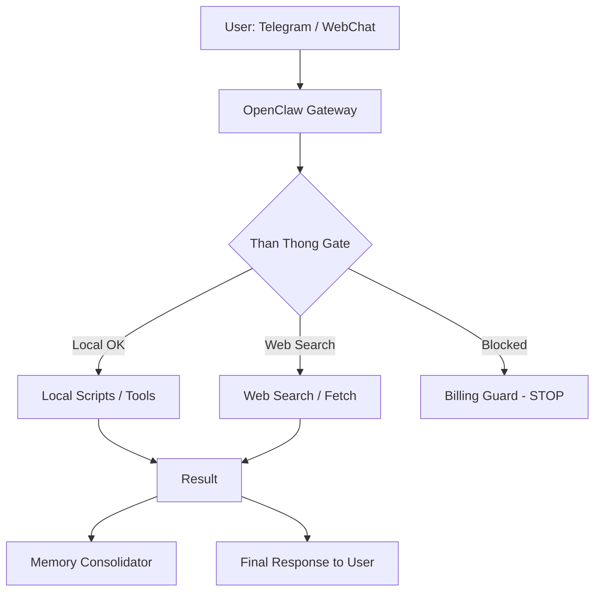
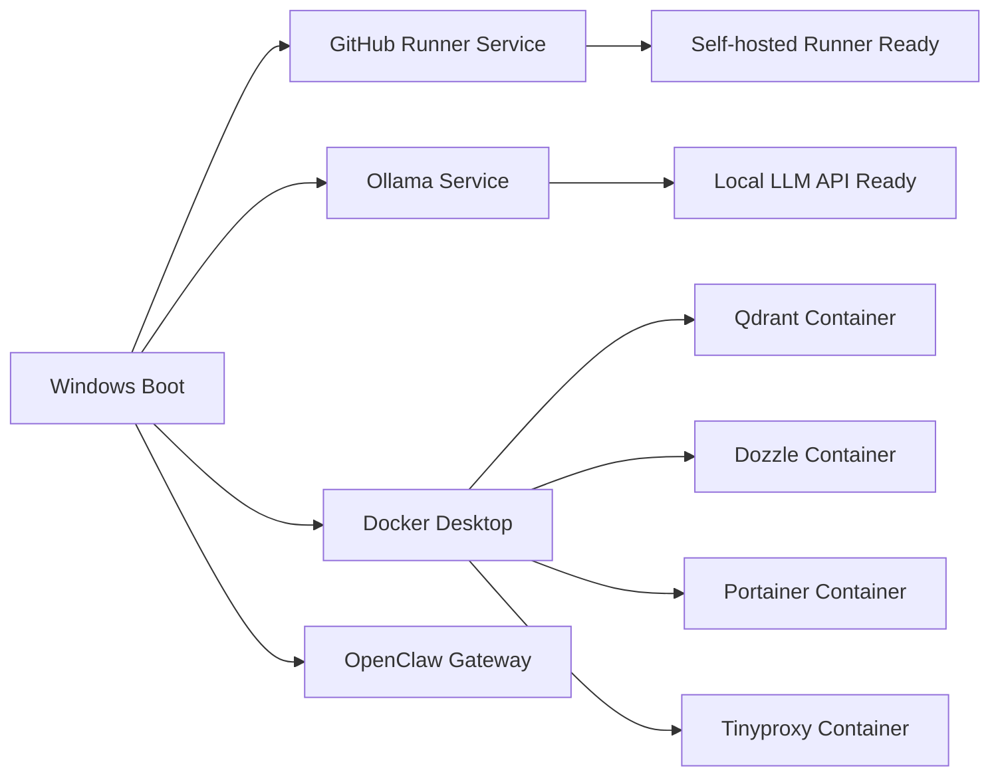
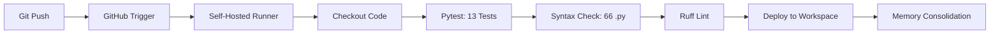
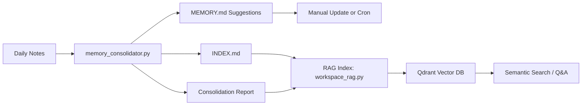
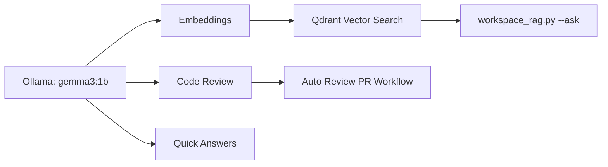
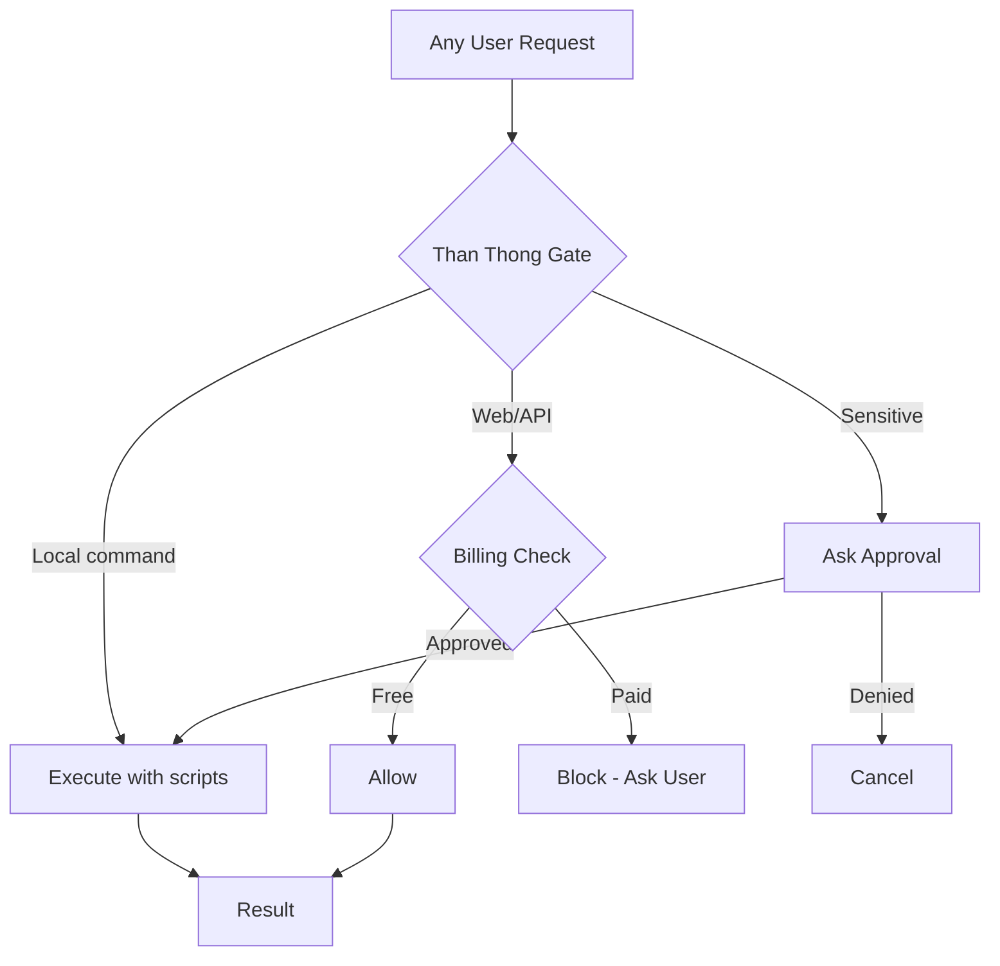
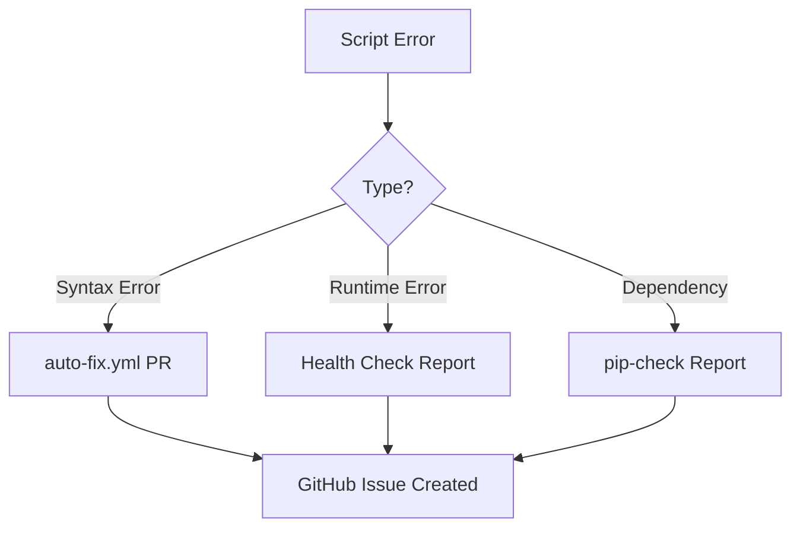
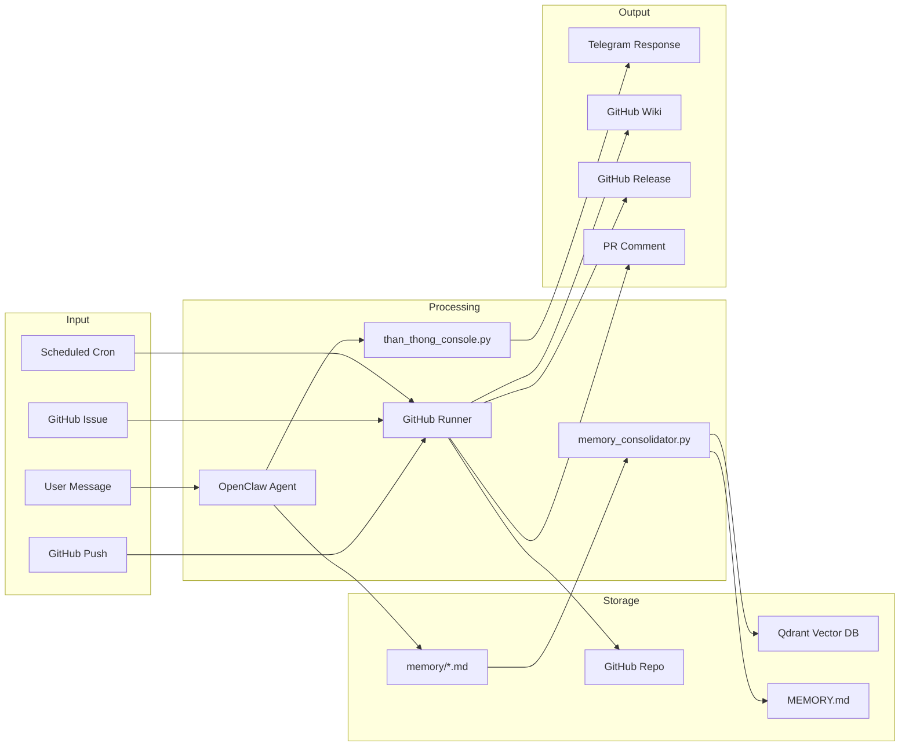

# OpenClaw Workflow Map

## 1. Main Interaction Flow

## 2. Startup Flow

## 3. CI/CD Pipeline (GitHub Actions)

### Workflow List

| Workflow | Trigger | What it does |
|---|---|---|
| **test.yml** | Push / PR | pytest + syntax + ruff |
| **deploy.yml** | Push master | Test + deploy to workspace |
| **pr-review.yml** | PR | Test + syntax + ruff + compliance |
| **auto-fix.yml** | Push | Auto-create PR for BOM fixes |
| **issue-handler.yml** | Issue | Classify + label + comment |
| **wiki-sync.yml** | Push / Weekly | MEMORY.md -> GitHub Wiki |
| **skill-check.yml** | Weekly Mon | Check awesome-skills for updates |
| **auto-backup.yml** | Daily 22:00 | Consolidate + commit + push |
| **release.yml** | Tag v* | Build + GitHub Release |
| **health-check.yml** | Daily 07:00 | Syntax + pip + service + disk |
| **pip-check.yml** | Weekly Mon | Check pip dependencies |
| **auto-review.yml** | PR | Local LLM reviews code changes |

## 4. Memory Pipeline

## 5. Local AI Pipeline

## 6. Security Gate Flow

## 7. Error Handling Flow

## 8. Data Flow Diagram

